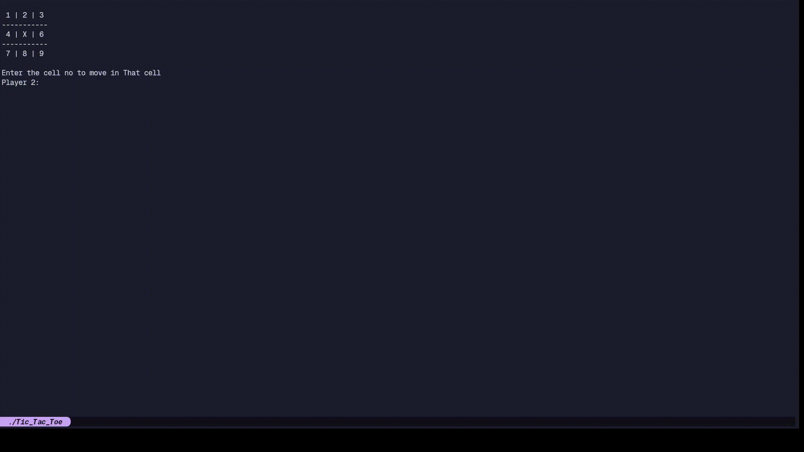

# Tic_Tac_Toe
A small C++ tic-tac-toe game with custom ANSI terminal control so the game stays clean and doesn't clutter the main terminal while it's running.

## Features
- Keeps the main terminal from getting spammed with game output
- Uses escape codes to add color to text
- Runs the gameplay in a separate alternative terminal window
- Keeps terminal-related logic separate from the actual game logic

### Gameplay


### Description
The gameplay itself is pretty standard, but the way it is presented is a bit different. Instead of mixing terminal rendering and game logic in one place, the project uses separate header and C++ files to manage the terminal design and screen behavior. That makes the flow smoother and lets the game use ANSI escape sequences to update the display cleanly.

## How to run
```bash
cmake -S . -B build
cmake --build build
./build/Tic_Tac_Toe
```

Enter the cell number when prompted to place your move and try to beat the other player.